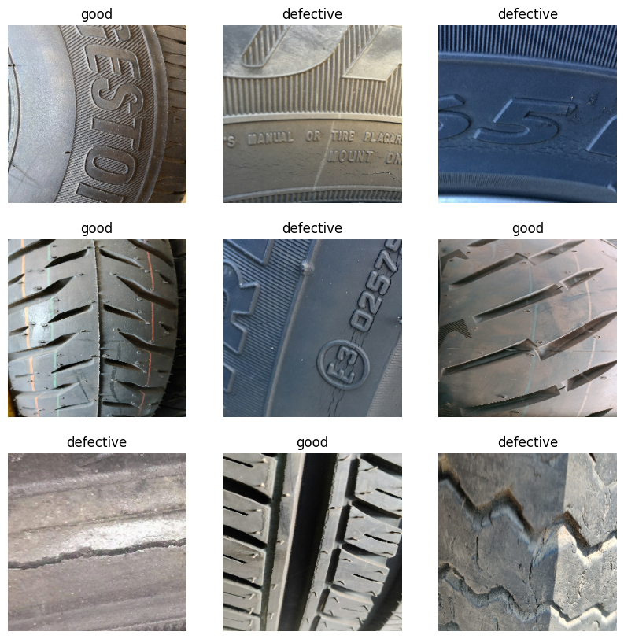

# Eyedentify

### Link to the app: https://eyedentify.streamlit.app/
### Demo video: https://www.canva.com/design/DAGF8-JTMR0/MQcJPzlXYoyBRFzFJaK1eg/watch?utm_content=DAGF8-JTMR0&utm_campaign=designshare&utm_medium=link&utm_source=editor

## About
Eyedentify is a project aimed at utilizing image classification techniques to address practical and meaningful challenges in various domains starting with industrial components quality control.

## Usecase
In this prototype of what this project can achieve, it checks the tyre conditions and classifies the tyre based on whether it is defective or not.

## How to use
Please upload an image of a tyre and let the magic happen!

### Sample images

